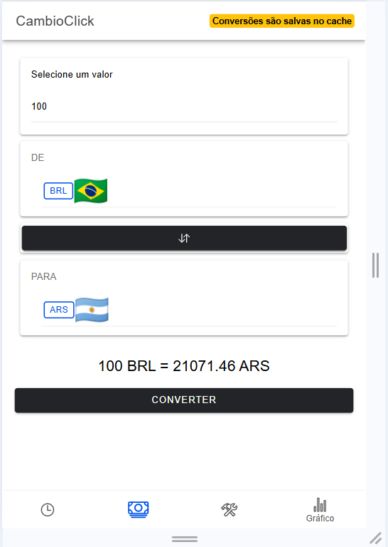
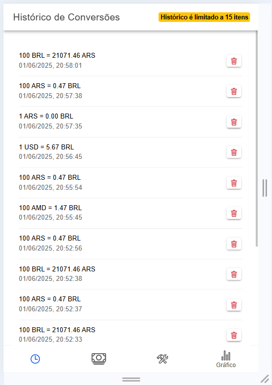
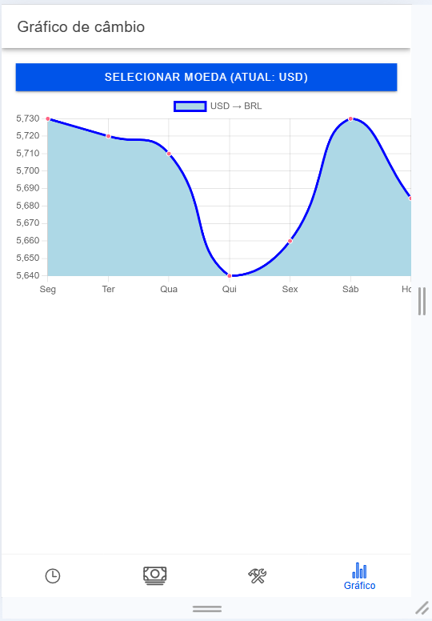
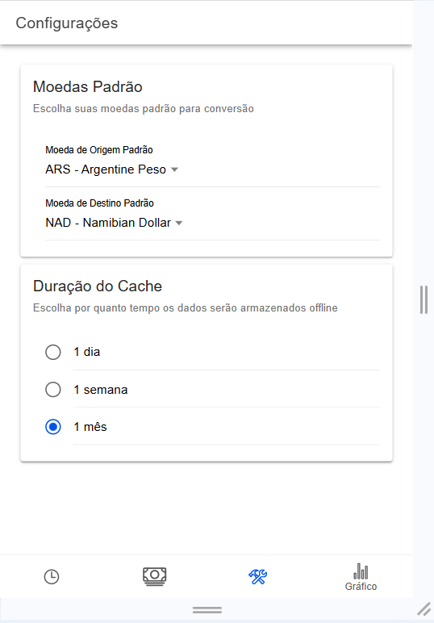

# CambioClick

CambioClick é um aplicativo mobile desenvolvido com **Ionic + Angular**, que permite ao usuário realizar conversões de moedas em tempo real, mesmo offline. A proposta é oferecer uma solução simples, rápida e acessível para quem precisa converter valores em diferentes moedas, com interface moderna e usabilidade intuitiva.

---

## 📥 Como baixar o repositório

Abra o terminal e execute os seguintes comandos:

```bash
git clone https://github.com/matheushenrique6/CambioClick.git
cd CambioClick
npm install
ionic serve
```

---

## 🧰 Pré-requisitos

Antes de iniciar o projeto, você precisa ter instalado na sua máquina:

- Node.js (versão LTS recomendada)
- NPM
- Ionic CLI

```bash
npm install -g @ionic/cli
```

---

## 🤝 Contribuindo

Para contribuir com este projeto, siga os passos abaixo:

```bash
# 1. Faça um fork do repositório
# 2. Crie uma nova branch
git checkout -b minha-nova-funcionalidade

# 3. Faça suas alterações e commit
git commit -m "feat: nova funcionalidade"

# 4. Faça o push para o seu fork
git push origin minha-nova-funcionalidade

# 5. Abra um Pull Request
```

> 📎 Consulte o [CONTRIBUTING.md](./CONTRIBUTING.md) para mais detalhes.

---

## 👥 Autores

- **Caio Nazário**  
  Matrícula: 01705728  
  GitHub: [@caionazario](https://github.com/caionazario)

- **Marlon Valadão**  
  Matrícula: 01785018  
  GitHub: [@marlonvaladao](https://github.com/marlonvaladao)

- **Matheus Xavier**  
  Matrícula: 01710608  
  GitHub: [@matheushenrique6](https://github.com/matheushenrique6)

- **Wagner Ferreira**  
  Matrícula: 01707236  
  GitHub: [@wagnerfgomes](https://github.com/wagnerfgomes)

---

## 📸 Imagens do Projeto

> Os arquivos devem estar na pasta `cambioclickdocs/mockup`:

  
  
  


---

## 🔀 Fluxo de trabalho Git

O fluxo adotado neste projeto é baseado em branches por funcionalidade ou semana:

1. Sempre desenvolva em uma branch separada.
2. Após testes e revisão, faça merge para a `main`.

📄 [Fluxo de Trabalho Git (PDF)](./cambioclickdocs/models/fluxo-git.pdf)

---

## 📚 Tutorial Git

Todos os comandos e boas práticas utilizadas estão explicados no tutorial:

📄 [Tutorial Git (PDF)](./cambioclickdocs/models/tutorial-git.pdf)

---

## 📄 Licença

Este projeto está licenciado sob a **Creative Commons Zero v1.0 Universal**.  
Você pode copiar, modificar, distribuir e executar o trabalho, mesmo para fins comerciais, sem pedir permissão.

Veja o arquivo [LICENSE](./LICENSE) para mais detalhes.
